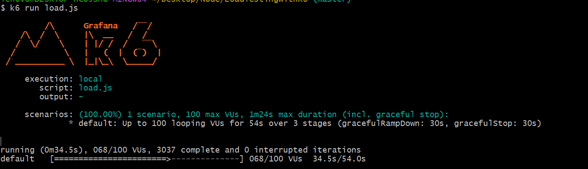
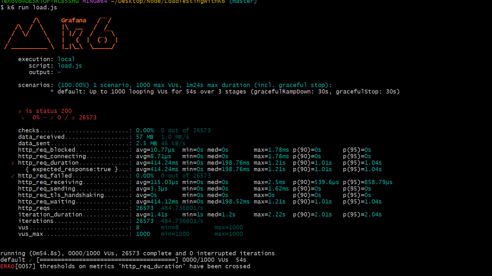

# what is stages in k6?

-- Stages is step in our load test
        example : {duration : '10s', target: 10}
        in 10 sec let say we want 10 user , so in this way we prepare gradual stages.

## Vus means virtual user

A virtual user represent concurrent user that interacts with the application during the load test.
each vu executesthe predefined test script. it is the integer value and take 1 as default value. 

## p(90), p(95)  what does it mean?

p(95) means 95% of request , if we say p(95) is less than 2000ms then 95% of our request should be completed in less than 2000ms means 2s

'p 95 in api -- google it'

http_req_duration : avg is our average latency, P(90) 90% of request having latency 5.08 ms or less

## throughput : total no request process/ given interval of time

http_reqs/Vus

Stress testing we gradually increase load then decrease, 90% of request now less than 1.5ms because there is not consistent load

# Spike Testing 

## Thresholds in K6

Threshold is like pass or fail criteria, let say we have dedicated ci/cd pipeline job which is doing performance testing for us, then how do we know whether our application  is still performing based on the old metrics or not, so we can define thresholds i.e we can define pass fail criteria that the no of fail request should be less than 1%

We define criteria and we failed one criteria 